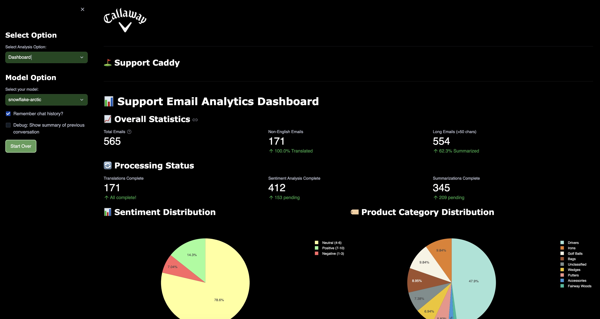
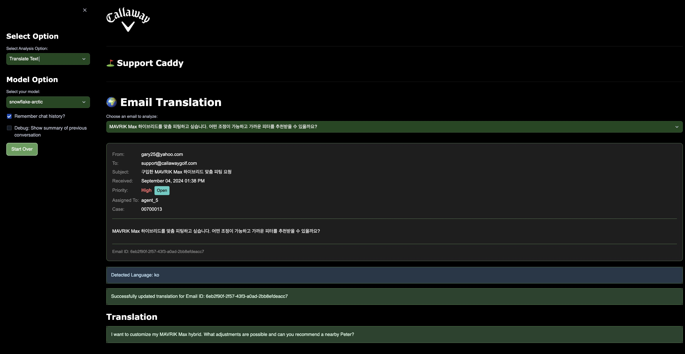
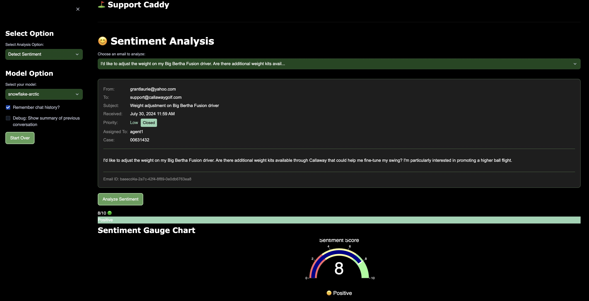

# Callaway Streamlit Email/Support Caddy App with Cortex LLM Function

## Packages to Import for the Streamlit App
- `plotly`
- `langdetect`

## Setup: Notebook Used for Initial Setup
1. Choose or create a database as needed.
2. Set up the table with the following command:
   - `CREATE_CS_TABLE`
3. Generate synthetic data using:
   - `GENERATE_CS_GOLF_DATA`

## Examples

